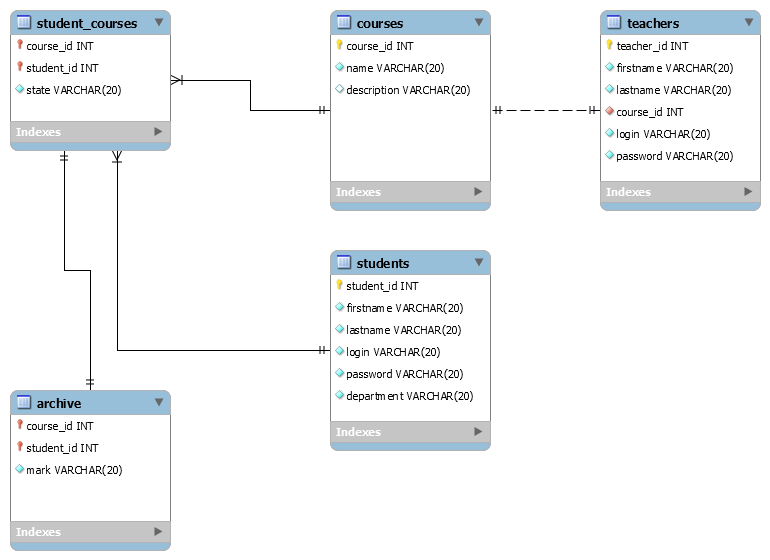

Courses for students
====================
  
Project represents the system of managing optional courses for students in a high school. On the web page a student selects one or more course and registers himself to the course. After attendance the lecturer who holds the course sets a mark to the student.  
The project has been rolled out on server: [https://devproserv.com/courses](https://devproserv.com/courses)
The project has been created for training purpose and is not to be used in real life.  
  
Description
-----------
The system runs on web server Tomcat with web container handling requests to servlets, JSP etc. Data about entities in the project is stored in the database MySQL.  
The project is developed using the following problem specification:  
  
_System of optional **courses**. There is a list of courses, each **course** is assigned to a **lecturer**. **Student** subscribes to one or more courses. Registration data is stored. After course completion lecturer evaluates it with a mark and data stores in the **archive**._

#### General requirements to the project
1. Build classes describing entities of the data domain  
2. Names of classes and methods should reflect their functionality and classes should have correct hierarchy  
3. Code should satisfy Java Code Convention  
4. Information about data domain should be kept in a database. API JDBC with connection pool (standard or custom) should be used for access into the database. MySQL or Derby are recommended as a database  
5. The application should support cyrillic (be multilingual), including information in DB  
6. Architecture of application should correspond to template Model-View-Controller  
7. During logic implementation GoF templates like Factory Method, Command, Builder, Strategy, State, Observer etc are to be used  
8. Implement functionality that is mentioned in the task using servlets and JSP  
9. Use JSTL library and custom tags on the JSPs  
10. During business logic development sessions and filters are to be used  
11. Implement event logging i.e. information about arising exceptions and events in the system is to be handled with Log4j  
12. The application should contain comments.  
  
#### Database schema

Software
------------
Web-Server: Apache Tomcat 8.5  
Database: MySQL Community Server 5.7  
Build tool: Maven  
CI tool: Jenkins  
IDE: Eclipse, Intellij IDEA  
Test tool: JUnit 5 
  
The project is hosted on Github. A job in Jenkins detects changes in the code on Github and builds a new version of web package and deploys it on the server.
  
Disclaimer
----------
The project is used exclusively for training purpose and does not take into account many important factors! For example, passwords in the database are stored in text fields instead of hashes that is completely unacceptable in real systems!
